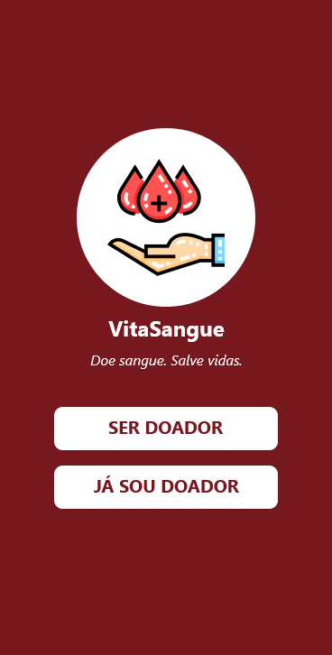
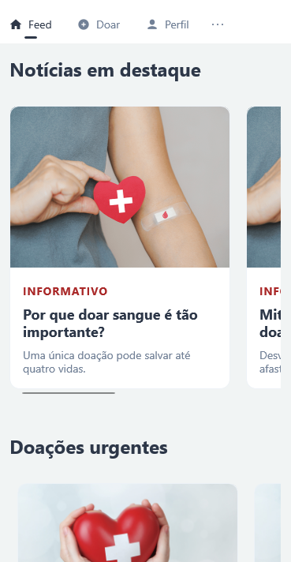
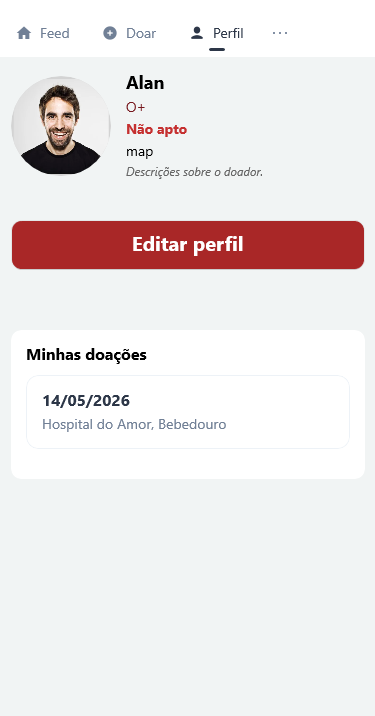

<p align="center">
  

  
  
  <a href="https://github.com/gurjonzito/AppVitaSangue/commits/master">
    
  </a>
    
   
   <a href="https://github.com/gurjonzito/AppVitaSangue/LICENSE.md">
  </a>

</p>

<details>
  <summary>Table of contents</summary>
  <ol>
    <li><a href="#about">About</a></li>
    <li><a href="#built-with">Build with</a></li>
    <li><a href="#screenshots">Screenshots</a></li>
    <li><a href="#development">Development</a></li>
    <li><a href="#license">License</a></li>
  </ol>
</details>

## About
This is a project made for the Mobile Programming class, an application for blood donation.

## Built with

* [![Visual Studio][Visual Studio]][Visual Studio-url]
* [![.NET MAUI][.NET MAUI]][.NET MAUI-url]
* [![C#][C#]][C#-url]
* [![SQL-Server][SQL-Server]][SQL-Server-url]

## Screenshots
<table>
  <tr>
    <td align="center">
      <br>
      <b>Home</b>
    </td>
    <td align="center">
      <br>
      <b>Feed</b>
    </td>
    <td align="center">
      <br>
      <b>Profile</b>
    </td>
  </tr>
</table>

## Development
```bash
$ git clone https://github.com/gurjonzito/AppVitaSangue.git
```

## License

Distributed under the MIT License. See `LICENSE.md` for more information.

<!-- Links -->
[.NET MAUI]: https://img.shields.io/badge/.NET_MAUI-512BD4?style=for-the-badge&logo=.net&logoColor=white
[.NET MAUI-url]: https://learn.microsoft.com/en-us/dotnet/maui/
[C#]: https://img.shields.io/badge/c%23-%23239120.svg?style=for-the-badge&logo=csharp&logoColor=white
[C#-url]: https://dotnet.microsoft.com/en-us/csharp
[Visual Studio]: https://img.shields.io/badge/Visual%20Studio-5C2D91.svg?style=for-the-badge&logo=visual-studio&logoColor=white
[Visual Studio-url]: https://visualstudio.microsoft.com/
[SQL-Server]: https://img.shields.io/badge/Microsoft_SQL_Server-CC2927?style=for-the-badge&logo=microsoft-sql-server&logoColor=white
[SQL-Server-url]: https://www.microsoft.com/sql-server/
